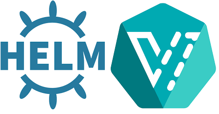

# KubeVirt


<br></br><br></br>

> Utilizing KubeVirt to run a Fedora VM on top of Kubernetes

[](https://github.com/cez-aug/github-project-boilerplate) [](https://creativecommons.org/publicdomain/zero/1.0/)

<br><br><br>

## Goals
> The goal of this folder is to create the helm charts necessary to launch KubeVirt Virtual Machines, the actual launching of the operator is not in scope for what we are trying to accomplish.

## Project Dependencies
* Minikube 1.5.2+
* Kubectl 1.16.2+
* Docker 19.03.5+
* KubeVirt v0.24.0+
* CDI v1.11.0+

## Current Progress & Steps

- [x] **Create Virtual Machine only if PVC is pre provisioned**
- [ ] **Increase the flexibility of the VM helm charts**
  - [x] Configurable Name
  - [x] Configurable Namespace
  - [x] Configurable static labels
  - [ ] User added dynamic labels
  - [x] Set running or dormant state
  - [x] Configurable memory
  - [x] Configurable CPU
  - [ ] Configurable Cloud InIt Script
    - [ ] Set Cloud init via variables
    - [ ] Set Cloud init via kubernetes secret
  - [ ] Add optional ssh exposed kubernetes service
  - [ ] Add optional vnc exposed kubernetes service
- [ ] **Create an example of rdp enabled VM and contribute it back to KubeVirt**
  - [ ] Fedora Workstation/Gnome
  - [ ] Cinnamon Desktop
- [ ] **Create a CDI enabled PVC with a seperate helm chart**
- [ ] **Increase flexibility of the CDI enabled PVC helm chart**
  - [ ] Make the OS configurable via differnt 
  - [ ] Set if statements that allow people to state desired OS rather than S3:// endpoints for a limited number of preset options
    - [ ] CentOS8 (if it works)
    - [ ] Fedorra 30
    - [ ] Ubuntu
    - [ ] RHEL
  - [ ] Enable choice between container image disk or pvc with helm if statement
- [x] **Create one chart to rule them all that successfully deploys the PVC, then after an appropriate amount of time deploys the VM**

## Usage

### __Option 1:__

> __Details:__ <br> Option 1 builds PVC separately from creating the VM with two different Helm charts


1. Deploy the PVC helm chart
```
helm install your-pvc-helm-deployment-name ./pvc-chart/
```
 
2. Wait for PVC chart to complete after importer has completed
```
watch -d kubectl get all
```
and/or
```
kubectl logs -f $(kubectl get all | grep importer | cut -c -28)
```

3. Deploy the VM helm chart
```
helm install your-vm-helm-deployment-name ./vm-chart/
```

4. Watch for completion when VM launches and access the VM
```
virtctl console fedora1
```


### __Option 2:__

> __Details:__ <br> Option 2 builds a data volume sequentially prior to creating the VM in one yaml

1. Deploy the data volume with VM helm chart
```
helm install your-vm-helm-deployment-name ./dv-vm-chart/
```

2. Watch for completion when VM launches and access the VM
```
virtctl console fedora1
```


## Helm chart Configuration

The following table lists the configurable parameters of the Kubevirt chart and their default values.

| Parameter                                | Description                                               | Default                         |
|------------------------------------------|-----------------------------------------------------------|---------------------------------|
| `namespace`                              | Namespace the VM will be deployed to                      | ```default```                   |
| `vmi.name`                               | Virtual Machine Name                                      | ```fedora1```                   |
| `vmi.timestamp`                          | If VM creation timestamp is needed                        | `null`                          |
| `vmi.labels.os`                          | Labeling for external pulling entities                    | `linux`                         |
| `vmi.labels.distro`                      | Labeling for external pulling entities                    | ```fedoraCloud30```             |
| `vmi.labels.domain`                      | Labeling for external pulling entities                    | ```domain```                    |
| `vmi.running`                            | State of VM at launch (if running then true, else false)  | `true`                          |
| `vmi.memory`                             | Denotes how much memory is allocated to vm                | `4096M`                         |
| `vmi.cpu`                                | Denotes how many cpus are allocated to vm                 | `2`                             |
| `vmi.devices.disks.disk.name`            | VM device disk name                                       | `disk0`                         |
| `vmi.devices.disks.disk.bus`             | VM device disk bus name                                   | `virtio`                        |
| `vmi.devices.disks.cdrom.name`           | VM device cdrom name                                      | `cloudinitdisk`                 |
| `vmi.devices.disks.cdrom.bus`            | VM device cdrom bus                                       | `sata`                          |
| `vmi.devices.disks.cdrom.readonly`       | VM device cdrom status                                    | `readonly`                      |
| `vmi.machineType`                        | VM machine type                                           | `q35`                           |
| `vmi.terminationGracePeriodSeconds`      | VM grace period timer                                     | `0`                             |
| `vmi.volumes.cloudinit`                  | Add a base64 encoded cloud init script to your vm         | `null`                          |
| `pvc.name`                               | Name of storage to build VM with                          | `fedora1`                       |
| `pvc.image`                              | Image source for VM                                       | `null`                          |
| `pvc.labels.app`                         | Labeling for external pulling entities                    | `containerized-data-importer`   |
| `pvc.accessModes`                        | Access mode status                                        | `ReadWriteOnce`                 |
| `pvc.storageClassName`                   | Storage class name                                        | `standard`                      |
| `pvc.storageSize`                        | Storage volume Size                                       | `10Gi`                          |


## Clean up
When you are finished with the vm & pvc
```
helm del your-helm-deployment-name
kubectl delete -f prereqs/pvc_fedora1.yml
```

